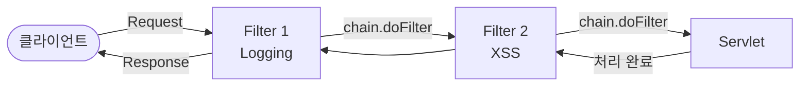

## 정의

웹 컴포넌트(Servlet/JSP)가 실행되기 **전/후**에 요청과 응답을 가로채서 부가적 기능을 수행하는 웹 컴포넌트.
여러 서블릿에 공통으로 필요한 기능(로깅, 인증, XSS 필터링)을 중앙에서 처리한다.

## 핵심 특성

- **규칙 기반 적용**: URL Pattern 또는 서블릿 이름으로 적용 대상 지정
- **양방향 동작**: `chain.doFilter()` 전 = 요청 처리, 후 = 응답 처리
- **체인 구성**: 여러 필터를 순서대로 연결하는 Filter Chain 패턴
- **Wrapper 패턴**: `HttpServletRequestWrapper`로 요청 객체를 감싸 파라미터를 가공 가능

## Filter 흐름도



## 주요 API / 문법

### Filter 작성

```java
@WebFilter("/*")
public class LoggingFilter extends HttpFilter implements Filter {

    @Override
    protected void doFilter(HttpServletRequest request,
                            HttpServletResponse response,
                            FilterChain chain)
            throws IOException, ServletException {

        // 요청 전처리
        System.out.printf("요청: %s %s%n", request.getMethod(), request.getRequestURI());
        request.getParameterMap().forEach((k, v) ->
            System.out.printf("  %s = %s%n", k, Arrays.toString(v)));

        chain.doFilter(request, response);  // 다음 필터 or 서블릿 호출

        // 응답 후처리 (필요 시)
    }
}
```

### Filter Mapping

| 방식 | 예시 | 설명 |
|------|------|------|
| URL Pattern | `@WebFilter("/*")` | 모든 요청에 적용 |
| 특정 경로 | `@WebFilter("/admin/*")` | /admin 하위 요청에만 적용 |
| Servlet 이름 | `@WebFilter(servletNames = "MainServlet")` | 특정 서블릿에만 적용 |

### HttpFilter vs Filter 인터페이스

| 구분 | Filter 인터페이스 | HttpFilter 추상 클래스 |
|------|-----------------|----------------------|
| 파라미터 타입 | `ServletRequest`, `ServletResponse` | `HttpServletRequest`, `HttpServletResponse` |
| 타입 캐스팅 | 직접 필요 | 불필요 |
| 권장 여부 | 구버전 호환 시 | **실무 권장** |

## XSS Filter — HttpServletRequestWrapper 패턴

```java
@WebFilter("/*")
public class XssFilter extends HttpFilter {

    @Override
    protected void doFilter(HttpServletRequest request,
                            HttpServletResponse response, FilterChain chain)
            throws IOException, ServletException {
        chain.doFilter(new XssRequestWrapper(request), response);
    }

    class XssRequestWrapper extends HttpServletRequestWrapper {

        public XssRequestWrapper(HttpServletRequest request) {
            super(request);
        }

        private String sanitize(String value) {
            if (value == null) return null;
            return value.replace("<", "&lt;").replace(">", "&gt;");
        }

        @Override
        public String getParameter(String name) {
            return sanitize(super.getParameter(name));
        }

        @Override
        public String[] getParameterValues(String name) {
            String[] values = super.getParameterValues(name);
            if (values == null) return null;
            return Arrays.stream(values).map(this::sanitize).toArray(String[]::new);
        }

        @Override
        public Map<String, String[]> getParameterMap() {
            Map<String, String[]> original = super.getParameterMap();
            Map<String, String[]> filtered = new HashMap<>();
            original.forEach((k, v) ->
                filtered.put(k, Arrays.stream(v).map(this::sanitize).toArray(String[]::new)));
            return Collections.unmodifiableMap(filtered);
        }
    }
}
```

## 필터 순서 제어

`@WebFilter` 어노테이션만 사용 시 순서는 **미보장** (Tomcat은 클래스명 알파벳 순서).
순서 보장이 필요하면 `web.xml`의 `<filter-mapping>` 순서로 제어한다.

```xml
<filter-mapping>
    <filter-name>LoggingFilter</filter-name>
    <url-pattern>/*</url-pattern>
</filter-mapping>
<filter-mapping>
    <filter-name>XssFilter</filter-name>
    <url-pattern>/*</url-pattern>
</filter-mapping>
```

## 주의사항 / 자주 하는 실수

> [!warning] 실수 포인트
> - `getParameter()`만 오버라이드하고 `getParameterMap()`은 오버라이드하지 않으면 로깅에서 원본(미필터링) 값이 출력됨
> - `getParameter()`, `getParameterValues()`, `getParameterMap()` 세 가지를 **모두 오버라이드**해야 완전한 XSS 필터링 적용
> - `@WebFilter` 어노테이션 추가/삭제는 서버 **재시작**이 필요 — 자동 재로드 불가
> - 로깅 필터가 `chain.doFilter()`를 호출하지 않으면 요청이 서블릿에 도달하지 않음

## Filter Chain 내부 구현 (Tomcat)

Tomcat은 `ApplicationFilterChain` 클래스로 필터 체인을 관리한다.
`chain.doFilter()` 호출 시 내부 인덱스를 증가시키며 다음 필터를 호출하고,
필터가 모두 소진되면 **자동으로 `servlet.service(request, response)`를 호출**한다.

```
chain.doFilter()
  → ApplicationFilterChain: 남은 필터 있음? → Filter.doFilter() 호출
  → ApplicationFilterChain: 필터 소진 → servlet.service() 직접 호출
      → HttpServlet.service(): HTTP Method 판별
          → 개발자가 오버라이드한 doGet() / doPost() 실행
```

> `chain.doFilter()`를 호출하지 않으면 요청이 서블릿에 도달하지 않는다 — 인증 필터에서 미로그인 시 차단하는 원리.

## @Override와 HttpFilter.doFilter 자동 생성

Eclipse "Add unimplemented methods"는 `Filter` 인터페이스의 추상 메서드(`doFilter(ServletRequest, ...)`)만 자동 생성한다.
`HttpFilter`의 `doFilter(HttpServletRequest, HttpServletResponse, FilterChain)`은 protected **구체 메서드**이므로 자동 생성 대상이 아니다.
Source → **Override/Implement Methods** 메뉴에서 직접 선택해야 한다.

`@Override`가 없어도 오버라이드는 정상 동작하지만, 시그니처 오타 시 컴파일러가 잡지 못하는 위험이 있으므로 명시하는 것이 권장된다.

## 관련 개념

- [[Servlet]] — Filter의 대상이 되는 웹 컴포넌트
- [[FrontControllerPattern]] — Filter와 함께 사용되는 공통 처리 패턴
- [[Listener]] — Filter와 함께 Servlet의 3대 컴포넌트
