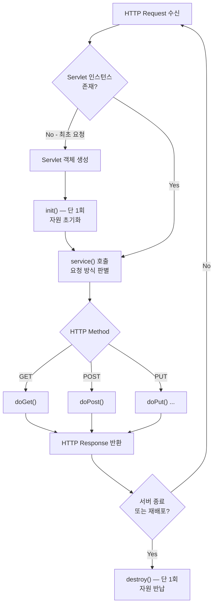
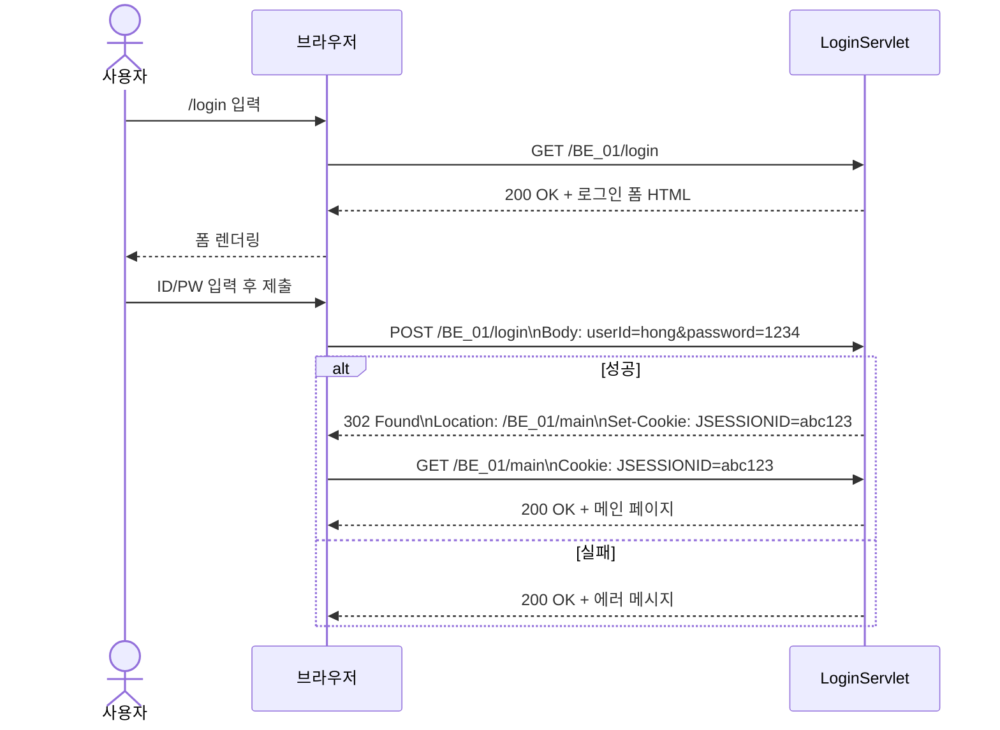

## 정의

WAS(Web Application Server)에서 실행되는 Java Web Component.
클라이언트의 HTTP 요청을 받아 처리하고 응답을 반환하는 서버 사이드 프로그램.

```java
@WebServlet("/hello")
public class HelloServlet extends HttpServlet { ... }
```

## 핵심 특성

- **Container 관리**: 개발자가 객체를 직접 생성/호출하지 않음 — Container가 Lifecycle 관리
- **단일 인스턴스**: Servlet 인스턴스는 하나만 생성, 다수 요청을 멀티스레드로 처리
- **URL Mapping**: `@WebServlet("/path")` 또는 `web.xml` `<url-pattern>`으로 경로 매핑
- **Jakarta EE**: Tomcat 10 이상은 `jakarta.servlet.*` (Tomcat 9 이하는 `javax.servlet.*`)

## Container Root vs Context Root

| 구분             | URL 예시                       | API                        |
| -------------- | ---------------------------- | -------------------------- |
| Container Root | `localhost:8080`             | —                          |
| Context Root   | `localhost:8080/BE_01`       | `request.getContextPath()` |
| Servlet        | `localhost:8080/BE_01/hello` | `@WebServlet("/hello")`    |

> `@WebServlet`의 `/`는 **Context Root** 기준이다.

## Servlet Lifecycle



### Lifecycle 단계

| 단계 | 메서드 | 실행 시점 |
|------|--------|-----------|
| 1 | 서블릿 객체 생성 (생성자) | 최초 요청 시 **1회** |
| 2 | `init()` | 최초 요청 시 **1회** |
| 3 | `service()` → `doGet()` / `doPost()` | **매 요청마다** |
| 4 | `destroy()` | 서버 종료/재배포 시 **1회** |

### Lifecycle 메서드

| 메서드 | 호출 시점 | 횟수 | 주요 용도 |
|--------|-----------|------|-----------|
| `init()` | 최초 요청 전 | **1회** | DB 커넥션, 설정 파일 로드 |
| `service()` | 매 요청마다 | N회 | HTTP Method 판별 후 do* 위임 |
| `doGet()` | GET 요청 | N회 | 조회 처리 |
| `doPost()` | POST 요청 | N회 | 데이터 제출 처리 |
| `destroy()` | 서버 종료/재배포 | **1회** | 자원 반납 |

### Lifecycle 실습 코드

```java
@WebServlet("/lifecycle")
public class LifeCycleServlet extends HttpServlet {

    public LifeCycleServlet() {
        super();
        System.out.println("LifeCycleServlet 객체 생성!");  // 생성자: 최초 1회
    }

    @Override
    public void init() throws ServletException {
        System.out.println("1. init() 호출 - 최초 요청 시 한 번만 실행");
    }

    @Override
    protected void doGet(HttpServletRequest request, HttpServletResponse response)
            throws ServletException, IOException {
        System.out.println("2. doGet() 호출 - 매 요청마다 실행");
    }

    @Override
    public void destroy() {
        System.out.println("3. destroy() 호출 - 서버 종료 시 실행");
    }
}
```

### 실행 결과 비교

**첫 번째 요청 (`/lifecycle`)**
```
LifeCycleServlet 객체 생성!   ← 생성자 (최초 1회)
1. init() 호출               ← init (최초 1회)
2. doGet() 호출              ← service → doGet
```

**두 번째 요청**
```
2. doGet() 호출              ← 객체 재사용, service → doGet만 실행
```

**서버 종료 시**
```
3. destroy() 호출            ← 자원 반납 (1회)
```

> [!note] 핵심 포인트
> - 객체 생성 + `init()`은 **최초 요청 시 단 한 번** — 이후 요청은 같은 인스턴스 재사용
> - `service()`는 호출되지만 콘솔 출력 안 함 — 내부적으로 `doGet()`/`doPost()` 위임
> - Servlet은 **싱글톤처럼 동작** — 인스턴스 1개로 멀티스레드 처리

## HttpServletRequest 주요 API

| 메서드 | 반환 타입 | 설명 |
|--------|-----------|------|
| `getMethod()` | String | HTTP 메서드 (GET, POST ...) |
| `getRequestURI()` | String | 전체 요청 URI |
| `getContextPath()` | String | Context Root 경로 (`/DynamicTest`) |
| `getServletPath()` | String | 서블릿 매핑 경로 (`/hello`) |
| `getParameter(name)` | String | 단일 파라미터 값 (없으면 null) |
| `getParameterValues(name)` | String[] | 동명 다중 파라미터 배열 |
| `getParameterMap()` | Map\<String, String[]\> | 전체 파라미터 Map |
| `getHeader(name)` | String | 특정 요청 헤더 값 |
| `getInputStream()` | ServletInputStream | 요청 Body를 바이너리 스트림으로 읽기 |

### Query String & Query Parameter

**Query String**은 URL에 `?` 뒤에 붙는 `key=value` 형식의 데이터 전달 방식이다.

```
GET /login?id=hong&password=1234 HTTP/1.1
         ↑
         ? 이후가 Query String
         id=hong&password=1234  ← Query Parameter 쌍
```

| 개념 | 설명 | 예시 |
|------|------|------|
| Query String | URL `?` 뒤 전체 문자열 | `id=hong&password=1234` |
| Query Parameter | Query String의 개별 key=value 쌍 | `id=hong` |

**GET vs POST 전달 방식 비교**

| 방식 | 전달 위치 | URL 노출 | 길이 제한 | 용도 |
|------|-----------|----------|-----------|------|
| GET Query String | URL (`?` 뒤) | O (노출됨) | 있음 (~2KB) | 검색, 조회 |
| POST Form Body | Request Body | X (숨겨짐) | 없음 | 로그인, 등록 |

**실전 코드 — LoginServlet**

```java
@WebServlet("/login")
public class LoginServlet extends HttpServlet {

    @Override
    protected void doGet(HttpServletRequest request, HttpServletResponse response)
            throws ServletException, IOException {

        // GET /login?id=hong&password=1234 로 요청 시
        String id = request.getParameter("id");          // "hong"
        String password = request.getParameter("password"); // "1234"

        System.out.println("id: " + id);
        System.out.println("password: " + password);
    }
}
```

> [!warning] null 주의
> 파라미터가 없으면 `getParameter()`는 `null` 반환.
> 반드시 null 체크 후 사용: `if (id != null && !id.isEmpty())`

### Request Parameter

- `<form>` 또는 Query String을 통해 클라이언트가 전달한 값
- 값은 **언제나 문자열(String)** — 타입 변환은 개발자가 직접 처리
- 최초 클라이언트에서 설정된 이후 **조작 불가** (읽기 전용)

## HttpServletResponse 주요 API

| 메서드 | 설명 |
|--------|------|
| `setStatus(code)` | 응답 상태 코드 설정 |
| `setContentType(type)` | Content-Type 헤더 설정 — `getWriter()` **이전**에 반드시 설정 |
| `setCharacterEncoding(enc)` | 응답 인코딩 설정 — `getWriter()` 전 설정 |
| `getWriter()` | 문자 스트림(PrintWriter) 반환 |
| `getOutputStream()` | 바이너리 스트림 반환 |
| `sendRedirect(url)` | 클라이언트에게 리다이렉트 응답 전송 |

### Content-Type

- 응답 데이터의 형식을 클라이언트에게 알려주는 헤더
- 예: `text/html;charset=UTF-8`, `application/json`, `image/png`
- Servlet에서는 `response.setContentType("text/html;charset=UTF-8")` 으로 설정

### Character Encoding

- 응답 데이터의 문자 인코딩 방식 지정
- `response.setCharacterEncoding("UTF-8")` 또는 `setContentType`에 charset 포함
- 한글 깨짐 방지를 위해 **반드시 `getWriter()` 호출 전에** 설정해야 함

## HTTP Method

| 메서드 | RFC | 안전 | 멱등 | 요청 Body | 응답 Body | 캐시 |
|--------|-----|------|------|-----------|-----------|------|
| GET | 9110 | O | O | X | O | O |
| HEAD | 9110 | O | O | X | X | O |
| POST | 9110 | X | X | O | O | X |
| PUT | 9110 | X | O | O | O | X |
| DELETE | 9110 | X | O | X | O | X |
| PATCH | 5789 | X | X | O | O | X |
| OPTIONS | 9110 | O | O | X | O | X |

> **안전(Safe)**: 서버 상태를 변경하지 않음
> **멱등(Idempotent)**: 같은 요청을 여러 번 보내도 결과 동일

## HTTP Status Code

| Category     | Code | Name                  | Description      |
| ------------ | ---- | --------------------- | ---------------- |
| 1xx 정보       | 100  | Continue              | 요청 진행 중          |
| 2xx 성공       | 200  | OK                    | 요청 성공            |
| 2xx 성공       | 201  | Created               | 리소스 생성 성공        |
| 2xx 성공       | 204  | No Content            | 성공, 응답 본문 없음     |
| 3xx 리다이렉트    | 301  | Moved Permanently     | 영구 리다이렉트         |
| 3xx 리다이렉트    | 302  | Found                 | 임시 리다이렉트         |
| 3xx 리다이렉트    | 304  | Not Modified          | 캐시 유효, 재전송 불필요   |
| 4xx 클라이언트 오류 | 400  | Bad Request           | 잘못된 요청 문법        |
| 4xx 클라이언트 오류 | 401  | Unauthorized          | 인증 필요            |
| 4xx 클라이언트 오류 | 403  | Forbidden             | 권한 없음            |
| 4xx 클라이언트 오류 | 404  | Not Found             | 리소스 없음           |
| 4xx 클라이언트 오류 | 405  | Method Not Allowed    | 허용되지 않는 HTTP 메서드 |
| 5xx 서버 오류    | 500  | Internal Server Error | 서버 내부 오류         |
| 5xx 서버 오류    | 503  | Service Unavailable   | 서비스 일시 불가        |

## HTTP 메시지 구조

### HTTP Request 구조

```
POST /BE_01/hello?name=홍길동 HTTP/1.1          ← 요청 라인 (Method URI HTTP버전)
Host: localhost:8080                             ← 헤더 시작
Content-Type: application/x-www-form-urlencoded
Content-Length: 17
Accept: text/html
                                                 ← 빈 줄 (헤더/바디 구분, CRLF)
num1=10&num2=20                                  ← 바디 (GET은 없음)
```

| 구성 요소 | 설명 | 예시 |
|-----------|------|------|
| 요청 라인 | `Method URI HTTP버전` | `GET /hello HTTP/1.1` |
| 요청 헤더 | 클라이언트 정보, 수락 형식 등 | `Host`, `Content-Type`, `Accept` |
| 빈 줄 | 헤더와 바디 구분 (CRLF) | |
| 요청 바디 | 전송 데이터 (GET은 없음) | `num1=10&num2=20` |

> **Query String vs Body**
> - GET: 데이터를 URI에 포함 → `?name=홍길동` (URL 노출, 길이 제한)
> - POST: 데이터를 Body에 포함 → URL에 노출 안 됨, 길이 제한 없음

### HTTP Response 구조

```
HTTP/1.1 200 OK                                  ← 상태 라인 (HTTP버전 상태코드 이유문구)
Content-Type: text/html;charset=UTF-8            ← 헤더 시작
Content-Length: 15
Date: Thu, 16 Apr 2026 02:00:00 GMT
                                                 ← 빈 줄
<html>안녕 홍길동</html>                           ← 바디
```

| 구성 요소 | 설명 | 예시 |
|-----------|------|------|
| 상태 라인 | `HTTP버전 상태코드 이유문구` | `HTTP/1.1 200 OK` |
| 응답 헤더 | 서버 정보, 응답 형식 등 | `Content-Type`, `Set-Cookie`, `Location` |
| 빈 줄 | 헤더와 바디 구분 (CRLF) | |
| 응답 바디 | 실제 응답 데이터 | HTML, JSON, 이미지 등 |

### 주요 요청 헤더

| 헤더 | 설명 | 예시 |
|------|------|------|
| `Host` | 요청 대상 서버 (HTTP/1.1 필수) | `localhost:8080` |
| `Content-Type` | 요청 바디 형식 | `application/x-www-form-urlencoded` |
| `Content-Length` | 요청 바디 길이(bytes) | `17` |
| `Accept` | 클라이언트가 처리 가능한 응답 형식 | `text/html, application/json` |
| `Cookie` | 클라이언트가 저장한 쿠키 전송 | `JSESSIONID=abc123` |
| `Authorization` | 인증 정보 | `Bearer eyJhbGci...` |

### 주요 응답 헤더

| 헤더 | 설명 | 예시 |
|------|------|------|
| `Content-Type` | 응답 바디 형식 | `text/html;charset=UTF-8` |
| `Content-Length` | 응답 바디 길이(bytes) | `15` |
| `Location` | 리다이렉트 대상 URL (3xx와 함께) | `http://localhost:8080/login` |
| `Set-Cookie` | 클라이언트에 쿠키 저장 지시 | `JSESSIONID=abc123; HttpOnly` |
| `Cache-Control` | 캐시 정책 | `no-cache`, `max-age=3600` |

---

## URL Mapping 방식 비교

| 방식 | 예시 | 특징 |
|------|------|------|
| `@WebServlet` 어노테이션 | `@WebServlet("/hello")` | 코드와 설정 한 곳에 |
| `web.xml` | `<url-pattern>/hello</url-pattern>` | 코드 수정 없이 경로 변경 가능 |

> **주의**: 두 방식을 동일 URL에 **중복 설정하면 Tomcat 시작 실패**

## 실전 시나리오: 로그인 흐름 (PRG 패턴)

### 전체 흐름



### 단계별 HTTP 메시지

**Step 1 — GET: 로그인 폼 요청**
```
→ GET /BE_01/login HTTP/1.1
  Host: localhost:8080

← HTTP/1.1 200 OK
  Content-Type: text/html;charset=UTF-8

  <form method="POST" action="/BE_01/login">...</form>
```

**Step 2 — POST: 자격증명 제출**
```
→ POST /BE_01/login HTTP/1.1
  Content-Type: application/x-www-form-urlencoded

  userId=hong&password=1234

← [성공] HTTP/1.1 302 Found
           Location: /BE_01/main
           Set-Cookie: JSESSIONID=abc123; HttpOnly
                                    ← 바디 없음

← [실패] HTTP/1.1 200 OK
           아이디 또는 비밀번호가 틀렸습니다.
```

**Step 3 — GET: 리다이렉트 후 메인 (브라우저 자동 재요청)**
```
→ GET /BE_01/main HTTP/1.1
  Cookie: JSESSIONID=abc123    ← Set-Cookie로 받은 쿠키 자동 전송

← HTTP/1.1 200 OK
  홍길동님 환영합니다!
```

### 핵심 포인트

| 항목               | 설명                                                            |
| ---------------- | ------------------------------------------------------------- |
| PRG 패턴           | POST → Redirect → GET: 새로고침 시 POST 재전송 방지                     |
| `sendRedirect()` | 302 + Location 헤더 → 브라우저가 새 GET 요청 자동 발송                      |
| `Set-Cookie`     | 서버 → 브라우저 쿠키 발급, 이후 매 요청마다 `Cookie` 헤더로 자동 전송                 |
| POST Body 형식     | `application/x-www-form-urlencoded` → `key=value&key2=value2` |

---

## 주의사항 / 자주 하는 실수

> [!warning] 실수 포인트
> - `response.setContentType()`을 `getWriter()` 이후에 설정하면 한글 깨짐
> - `@WebServlet`과 `web.xml` 둘 다 같은 URL에 매핑하면 `IllegalArgumentException`
> - `init()` 출력은 브라우저가 아닌 **Eclipse Console(Tomcat 로그)**에서 확인
> - Servlet은 기본 Lazy Loading — 서버 시작 시가 아닌 **첫 요청 시** `init()` 호출
> - POST 성공 후 `sendRedirect()` 없이 직접 HTML 출력하면 새로고침 시 중복 제출 발생
