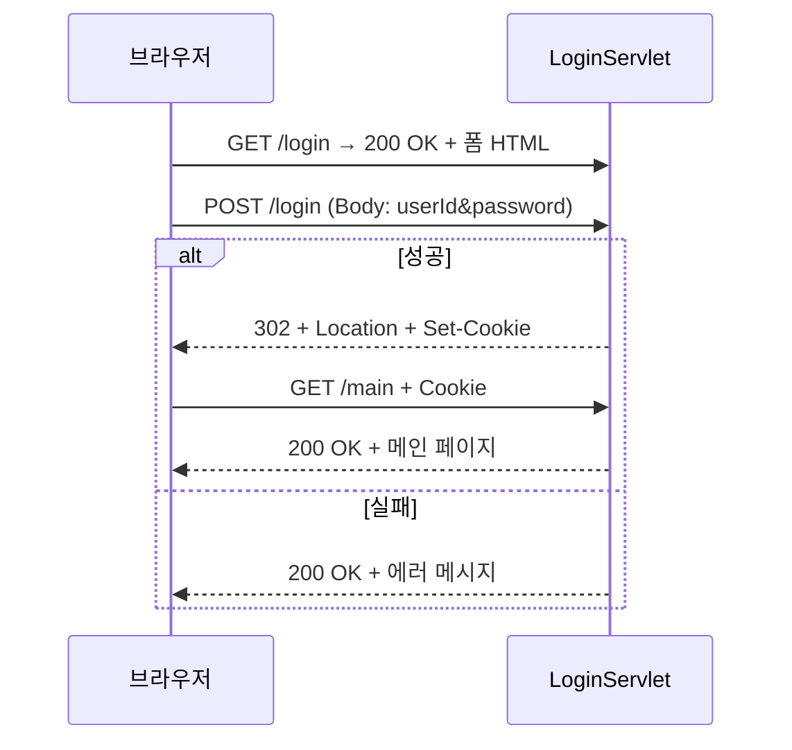

## 오늘 학습한 개념

- [[웹아키텍처]] — Web Server(정적) vs WAS(동적), Tomcat과 Servlet의 관계
- [[Servlet]] — WAS에서 실행되는 Java Web Component, Container가 Lifecycle 관리
- [[Maven]] — pom.xml 기반 빌드 자동화 및 의존성 관리

## 핵심 코드 스니펫

```java
@WebServlet("/hello")
public class HelloServlet extends HttpServlet {

    @Override
    public void init() throws ServletException {
        // 최초 1회: 무거운 자원 초기화 (DB 커넥션 등)
        System.out.println("무거운 자원 초기화");
        super.init();
    }

    @Override
    protected void doGet(HttpServletRequest request, HttpServletResponse response)
            throws ServletException, IOException {
        // 요청 분석
        System.out.printf("URI: %s, Method: %s%n",
            request.getRequestURI(), request.getMethod());

        request.getParameterMap().forEach((k, v) -> {
            System.out.printf("name: %s, value: %s%n", k, Arrays.toString(v));
        });

        // 응답 — getWriter() 전에 반드시 setContentType 설정
        response.setContentType("text/html;charset=UTF-8");
        String name = request.getParameter("name");
        response.getWriter().append("안녕 " + name);
    }

    @Override
    public void destroy() {
        // 최후 1회: init에서 초기화한 자원 반납
        System.out.println("init에서 초기화한 자원 반납");
        super.destroy();
    }
}
```

## HTTP 메시지 구조

### Request

```
GET /BE_01/hello?name=홍길동 HTTP/1.1   ← 요청 라인
Host: localhost:8080                    ← 헤더
Accept: text/html
                                        ← 빈 줄 (CRLF)
                                        ← 바디 없음 (GET)
```

### Response

```
HTTP/1.1 200 OK                         ← 상태 라인
Content-Type: text/html;charset=UTF-8   ← 헤더
Content-Length: 15
                                        ← 빈 줄
안녕 홍길동                               ← 바디
```

| 구성 | Request | Response |
|------|---------|----------|
| 첫 번째 줄 | `Method URI HTTP버전` | `HTTP버전 상태코드 이유문구` |
| 헤더 | Host, Content-Type, Accept, Cookie ... | Content-Type, Location, Set-Cookie ... |
| 바디 | POST/PUT만 존재 | 대부분 존재 (204 제외) |

---

## 핵심 개념 정리

### Container Root vs Context Root

| 구분 | URL 예시 | 설명 |
|------|----------|------|
| Container Root | `localhost:8080` | Tomcat WAS 자체 |
| Context Root | `localhost:8080/BE_01` | 개별 웹 애플리케이션 |
| Servlet URL | `localhost:8080/BE_01/hello` | `@WebServlet("/hello")` 기준 |

### Servlet Lifecycle 요약

```
최초 요청  → 객체 생성 → init() → service() → doGet()/doPost()
이후 요청  →                       service() → doGet()/doPost()
서버 종료  →                                             destroy()
```

### HTTP Method 핵심

| 메서드 | 안전 | 멱등 | Body |
|--------|------|------|------|
| GET | O | O | X |
| POST | X | X | O |
| PUT | X | O | O |
| DELETE | X | O | X |

## 트러블슈팅 기록

- `web.xml` + `@WebServlet` 중복 매핑 → `IllegalArgumentException` — 한쪽만 사용
- `init()` 출력 안 보임 → Eclipse Console 탭 확인, 첫 요청 시 호출됨 (Lazy Loading)
- `web.xml` 버전 2.5 자동 생성 → Project Facet이 구버전으로 설정된 것 → `jst.web 6.0`으로 변경
- Eclipse 파일 저장 안 됨 → STS 재시작 후 WSL에서 직접 파일 작성으로 해결

## 오늘의 인사이트

> [!quote] 핵심 기억
> Servlet은 개발자가 생성/호출하지 않는다. Container가 Lifecycle을 관리한다.
> `init()`은 **단 한 번**, `destroy()`도 **단 한 번** — `service()`만 매 요청마다 호출.
> `response.setContentType()`은 반드시 `getWriter()` **이전**에 호출해야 한글이 깨지지 않는다.

## 로그인 흐름 (PRG 패턴)



| 단계 | Status | 핵심 헤더 |
|------|--------|-----------|
| GET 폼 응답 | 200 OK | `Content-Type: text/html` |
| POST 성공 응답 | 302 Found | `Location`, `Set-Cookie` |
| POST 실패 응답 | 200 OK | `Content-Type: text/html` |
| GET 메인 요청 | — | `Cookie: JSESSIONID=...` |

> **PRG 패턴**: POST 성공 후 `sendRedirect()` → 새로고침 시 POST 재전송 방지

## 다음에 복습할 것

- [ ] `web.xml` 방식 vs `@WebServlet` 어노테이션 방식 차이와 우선순위
- [ ] `load-on-startup`으로 서버 시작 시 `init()` 즉시 호출하기
- [ ] `HttpServletResponse.sendRedirect()` vs `RequestDispatcher.forward()` 차이
- [ ] Maven `pom.xml` scope 종류 (compile, provided, runtime, test)
- [ ] JSP와 Servlet 연동
